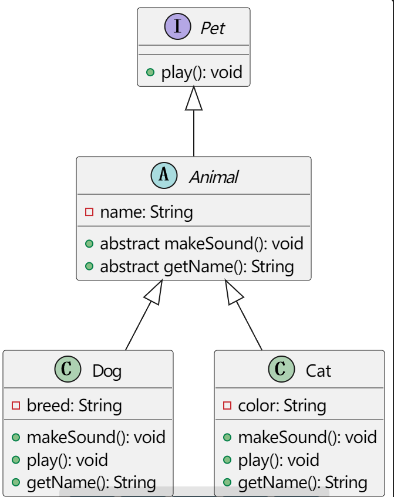

# 16.01.2023 System Modelling

# Question 6 18

----

## Question 6

**What does abstraction mean in a class diagram? What elements can be made an abstract? What is the benefit of having them? Provide an example of an abstract element.**

**Answer 6:**

Abstraction in the context of a class diagram is a fundamental concept in object-oriented modeling. It refers to the process of identifying only the necessary characteristics of an object, while ignoring the irrelevant details. In simpler terms, abstraction is about focusing on the essential features of an object in relation to the context in which it is used.

In class diagrams, abstraction is often implemented through abstract classes and interfaces:

**Abstract Classes**: These are classes that cannot be instantiated on their own. They are typically used as base classes from which other classes can derive. An abstract class may contain abstract methods (methods without implementation) as well as concrete methods (with implementation). The abstract methods act as a template to be implemented by the subclasses.

**Interfaces**: These are similar to abstract classes in that they cannot be instantiated and can contain only abstract methods. However, interfaces differ in that they do not contain any implementation at all and can be implemented by any class, from any inheritance tree.

**The benefit of using abstraction in class diagrams includes:**

**Encapsulation of Common Features:** Abstract classes and interfaces allow for the encapsulation of common features and behaviors, which can be reused by multiple subclasses or implementing classes. This promotes code reusability.

**Flexibility and Scalability**: Abstraction provides a flexible and scalable approach for system development. Changes in abstract classes or interfaces can be easily propagated to derived classes, facilitating easier maintenance and evolution of the system.

**Design Clarity**: Abstraction helps in creating a clear and understandable design. It allows designers to focus on the high-level structure of the system without getting bogged down in details.

Enforcement of Standards: By defining abstract methods in an abstract class or an interface, you can enforce a certain contract or standard that all the derived or implementing classes must follow.

An example of an abstract element:

#### Question 18

**What types of frames can be used in sequence diagrams? What is their purpose? Name at least 3 types and show an example of each.**

**Answer 18:**

In sequence diagrams, frames are used to denote different types of control structures that affect the flow of messages and interactions. They provide a way to handle more complex scenarios such as alternatives, loops, and conditional flows. 

**1. Alt Frame (Alternative)**

An `alt` frame is used to represent alternative paths through the sequence. Each compartment in the `alt` frame represents a branch of the conditional flow.

This sequence diagram uses an `alt` frame to depict two alternative interactions: one for a successful action and another for a failure.

**2. Loop Frame**

A `loop` frame indicates that a sequence of interactions is repeated a number of times, which could be dependent on a condition.

In this example, the `loop` frame is used to show that the `User` sends a message to the `System` to increment a value until a certain condition is met.

**3. Opt Frame (Optional)**

An `opt` frame represents an optional interaction that will only occur under a specific condition.

This diagram shows an optional interaction where the `System` provides a feature to the `User` only if the feature is enabled.

These frames help to structure the flow in sequence diagrams, making it possible to model complex logic and decision-making processes within interactions.

